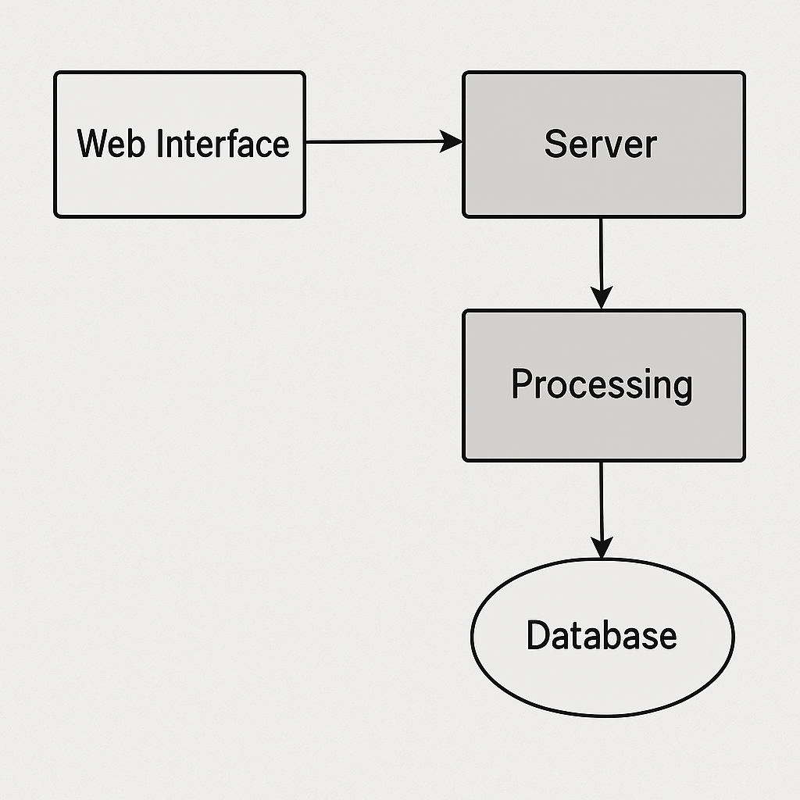

# Hydra – DDoS / DoS Testing Tool

> **Status:** 🚧 Under development

Hydra is a **Go-based security testing utility** for simulating Denial-of-Service (DoS) attack scenarios in **authorized environments**.  It provides a **REST API** and **web interface** for starting/stopping simulated attacks, monitoring status, and testing application/network resilience.

⚠ **Disclaimer:**
This tool is intended **only for educational and authorized penetration testing purposes**.
Unauthorized use against systems you do not own or have explicit permission to test is illegal.
The author assumes **no responsibility** for misuse.

---

## ✨ Features

* **Start/Stop Attacks** via REST API.
* **Live Monitoring** of:
  * Attack status (running/idle)
  * Total requests sent
  * Target URL
  * Workers (concurrent requests)
  * POST payload size
* **Web UI** for control and monitoring.
* **Configurable Parameters**:
  * Target URL
  * Number of workers
  * POST data size
* **Security Controls**:
  * API key authentication
  * Rate limiting
  * HTTPS support

---

## 🛠 Installation

### Prerequisites

* [Go](https://go.dev/dl/) (1.20+ recommended)
* [Docker](https://docs.docker.com/get-docker/) *(optional, for containerized deployment)*

### Clone the Repository

```bash
git clone https://github.com/zerotrace0x/hydra-ddos-tool.git
cd hydra-ddos-tool
```

### Build (Local)

```bash
go build -o hydra-server ./server
```

### Run (Local)

```bash
./hydra-server
```

---

## 📦 Docker Deployment

```bash
docker build -t hydra-ddos .
docker run -p 8080:8080 hydra-ddos
```

---

## 📡 API Usage

**Start Attack**

```bash
curl -X POST "http://localhost:8080/start" \
     -H "Authorization: Bearer <API_KEY>" \
     -H "Content-Type: application/json" \
     -d '{"target":"https://example.com","workers":10,"postSize":1024}'
```

**Stop Attack**

```bash
curl -X POST "http://localhost:8080/stop" \
     -H "Authorization: Bearer <API_KEY>"
```

**Check Status**

```bash
curl -X GET "http://localhost:8080/status" \
     -H "Authorization: Bearer <API_KEY>"
```

---

## 🧩 Project Structure

```
.
├── api/              # API server code
├── web/              # Web interface (HTML/JS/CSS)
├── server/           # Go application logic
├── docker/           # Docker build files
├── certs/            # SSL certs (ignored in .gitignore)
└── README.md
```

---

## 🗺 Project Architecture



---

## 📜 Compliance & Ethical Use

* **PCI DSS / DORA Alignment** – Can be used in controlled lab simulations for resilience testing.
* Always follow an **engagement scope** and **Rules of Engagement (RoE)**.
* Never test on live systems without **written permission**.

---

## 📄 License

This project is licensed under the [MIT License](LICENSE).